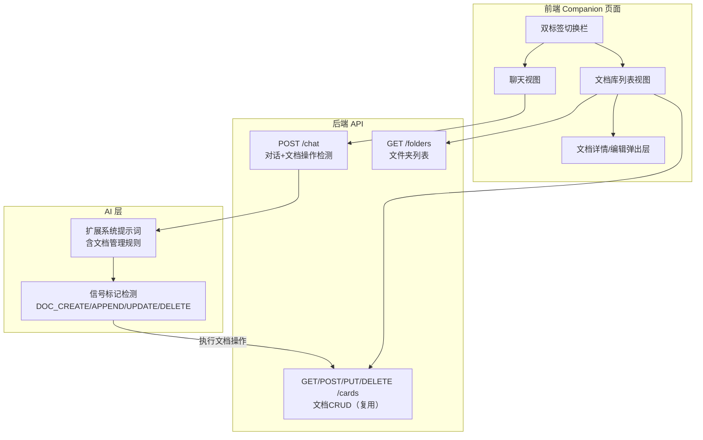

## 用户需求

在陪伴页（Companion）新增「用户文档库」功能，文档像图书馆一样按微信对话列表风格排列，后端 AI 能够通过自然语言指令管理文档。

## 核心功能

- **陪伴页双标签切换**：页面顶部新增「聊天」/「文档库」两个标签，点击切换视图
- **文档库列表**：文档以微信对话列表风格展示，每条显示图标 + 标题 + 内容预览（前50字）+ 更新日期，点击进入文档查看/编辑
- **AI 文档管理**：在聊天标签下，Cloudie 理解用户自然语言指令，自动创建、追加内容、修改文档；删除操作需先征求用户确认，确认后执行
- **文档详情编辑**：点击文档进入详情页，可查看完整内容并进行手动编辑

## 技术栈

- 前端：快应用 .ux 单文件组件 + less
- 后端：FastAPI + SQLAlchemy 异步 + SQLite
- 复用现有：Folder/Card 模型、memory.py CRUD API、cards.js 前端 API

## 方案设计

### 整体策略

**不新增独立页面**，所有改动在 Companion 页面内部完成。复用现有 Folder + Card 数据模型和 memory.py 的 CRUD API（GET/POST/PUT/DELETE /cards）。AI 文档操作通过扩展 Cloudie 系统提示词 + 信号标记机制实现，与现有的 [MEMORY_UPDATE] 模式一致。

### 核心架构



### 后端设计

#### 1. AI 文档操作信号标记（扩展 cloudie_prompt.py）

在现有系统提示词中追加文档管理规则，定义5种信号标记：

| 标记 | 格式 | 说明 |
| --- | --- | --- |
| `[DOC_CREATE]` | `[DOC_CREATE]\n标题: xxx\n内容: xxx` | 新建文档 |
| `[DOC_APPEND:id]` | `[DOC_APPEND:123]\n追加内容: xxx` | 追加内容到指定文档 |
| `[DOC_UPDATE:id]` | `[DOC_UPDATE:123]\n标题: xxx\n内容: xxx` | 修改文档 |
| `[DOC_DELETE_ASK:id]` | `[DOC_DELETE_ASK:123]` | 提示用户确认删除 |
| `[DOC_DELETE_CONFIRM:id]` | `[DOC_DELETE_CONFIRM:123]` | 用户确认后执行删除 |


**删除确认流程**：用户说"删除xxx文档" → AI 回复中使用 `[DOC_DELETE_ASK:id]` 要求确认 → 用户回复"确认" → AI 在回复中使用 `[DOC_DELETE_CONFIRM:id]` → 后端执行删除。

#### 2. chat.py 信号检测扩展

在 `chat_endpoint` 中新增文档操作信号的检测和处理逻辑：

- 用正则匹配 `[DOC_CREATE]` / `[DOC_APPEND:\d+]` / `[DOC_UPDATE:\d+]` / `[DOC_DELETE_CONFIRM:\d+]`
- 匹配后调用 memory.py 中对应的 Card CRUD 操作
- `[DOC_DELETE_ASK]` 不执行操作，仅提示用户
- 清理回复中的标记文本后返回给前端

#### 3. 数据模型（复用现有）

直接复用现有的 Folder + Card 模型，不新增表：

- `Card.type = "doc"` 标识文档类型
- `Card.folder_id` 可选关联文件夹
- 通过 `family_id` 隔离家庭组数据

### 前端设计

#### Companion 页面结构变化

```
原结构：
├── 侧边栏（对话记录）
├── 主聊天区
│   ├── 顶部标题栏 "Cloudie"
│   ├── 对话消息列表
│   └── 底部输入区
└── TabBar

新结构：
├── 侧边栏（对话记录）
├── 主区域
│   ├── 顶部标签栏 [聊天] [文档库]  ← 新增
│   ├── 聊天视图（if activeTab==='chat'）
│   │   ├── 对话消息列表
│   │   └── 底部输入区
│   ├── 文档库视图（if activeTab==='docs'）  ← 新增
│   │   └── 文档列表 + 刷新
│   └── 文档详情弹出层  ← 新增
└── TabBar
```

#### 文档列表组件（WeChat 风格）

每条文档显示为：

- 左侧：文档图标（📄 emoji）
- 中间：标题（最多1行）+ 内容预览（最多1行，50字内）
- 右侧：更新日期（如 2026.07.05）
- 点击进入详情弹出层

#### 文档详情弹出层

- 标题输入框
- 文本域编辑正文
- 底部按钮：「保存修改」「删除」
- 删除弹出二次确认对话框

### 数据流

```
[聊天模式] 用户: "帮我创建菜谱文档" 
→ POST /chat → AI 回复含 [DOC_CREATE]\n标题:家庭菜谱\n内容:红烧肉做法...
→ chat.py 检测标记 → POST /cards {type:"doc", title:"家庭菜谱", content:"红烧肉做法..."}
→ 返回干净回复给前端

[文档库模式] 用户点击文档
→ 弹出详情层 → 编辑 → PUT /cards/{id}
→ 删除 → 确认弹窗 → DELETE /cards/{id}
```

## 实现细节

### 需要修改的文件

| 层级 | 文件 | 改动类型 | 说明 |
| --- | --- | --- | --- |
| 后端 | `cloudie_prompt.py` | 修改 | 扩展 CLOUDIE_SYSTEM_PROMPT，追加文档管理规则和5种信号标记定义 |
| 后端 | `chat.py` | 修改 | 在 chat_endpoint 中新增文档信号检测和 CRUD 执行逻辑 |
| 前端 | `Companion/index.ux` | 重写 | 新增双标签切换+文档库视图+文档详情弹出层 |
| 前端 | `apis/cards.js` | 修改 | 补充文档专用方法（listByType 等，可选优化） |


### 关键实现注意点

1. **信号标记正则**：使用 `re.compile(r'\[DOC_CREATE\].*?\n(.+?)(?=\n\[|$)', re.DOTALL)` 等模式匹配不同标记
2. **回复清理**：在返回给前端前，用正则移除所有 `[DOC_*]` 标记及其关联内容
3. **并发安全**：chat.py 中信号处理复用同一 AsyncSessionLocal session，与消息存储在同一事务中
4. **删除确认**：`[DOC_DELETE_ASK]` 仅提示不操作，后端维护一个短暂的删除待确认映射（可选，或依赖AI上下文判断）
5. **前端性能**：文档列表首次加载 GET /cards?type=doc&limit=100，后续 onShow 刷新

## 设计风格

延续 Companion 页面的莫兰迪色系（暖灰底、鼠尾草绿、烟粉、雾蓝），新增文档库视图保持一致的柔和暖调。

## 页面设计

### 顶部双标签切换栏

- 位置：原标题栏位置，两个标签并排
- 「聊天」标签：雾蓝色（#a3b5c7）高亮选中态
- 「文档库」标签：同等样式
- 切换时有平滑过渡，下方内容区滑动切换

### 文档库列表（微信风格）

- 白色圆角卡片底色
- 左：文档图标 📄，圆形浅灰背景
- 中上：标题，30px 深灰色加粗，单行截断
- 中下：内容预览，24px 浅灰色，单行截断（前50字）
- 右：日期，20px 更浅灰色
- 底部 1px 暖灰分割线
- 点击整行高亮反馈，进入详情

### 文档详情弹出层

- 底部滑入式弹出面板
- 标题栏：文档标题输入框 + 关闭按钮
- 正文：大文本域，最少 3 行
- 底部：保存（雾蓝）按钮 + 删除（烟粉）按钮
- 删除二次确认：居中弹窗"确认删除该文档？"，取消/确认双按钮

### 空状态

- 文档库为空时显示 📄 大图标 + "还没有文档，去和 Cloudie 聊聊吧"